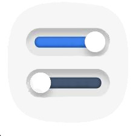

# Ubuntu Applications and important Commands
> ## Quick Action
>-  ### Some Important Applications
>       - [SM Player](#sm-player)


## Some Important Applications

### SM Player


To download and install
```
sudo add-apt-repository ppa:rvm/smplayer 
sudo apt-get update 
sudo apt-get install smplayer smplayer-themes smplayer-skins
```

 ### 2) GNOME Tweek tool


To download and install
```
sudo add-apt-repository universe
sudo apt install gnome-tweak-tool
```

## Some important Shell commands  

 ### Installing Application after downloading zip, which contain 'install.sh' file 

Firstly Grant all Permissions,

```
chmod +x install.sh
```
then type,
```
./install.sh
```
or
```
sh install.sh	
```	
 ### Unstalling Applications in its file which contain 'uninstall.sh' file 

Firstly Grant all Permissions,

```
chmod +x uninstall.sh
```
then type,
```
./uninstall.sh
```
or
```
sh uninstall.sh	
```	
 ### Installing Node from Downloaded zip file
```
sudo tar -xf node-v12.17.0-linux-x64.tar.xz --directory /usr/local --strip-components 1
```
